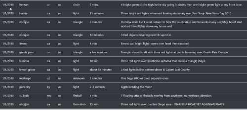
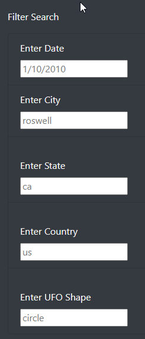
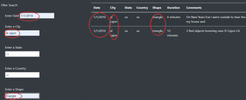

# Overview of the UFO Data Analysis

### This module,  a table was create from a JSON data array. The table we brought in using Javascript and HTML code to create an interactive, filterable web based table. This table will have the ability to filter data based on multiple criteria.

 

## Results and Explanation of the  Filtering of the UFO sightings webpage on **multiple criteria**

 

#### Using the search criteria

1.  Read the background information at the top of the page to get an idea of the project:

     

1. Look at the columns of data in the full UFO table:

     

1. Look at the full table of data to see what the data look like before filtering.

     

1. Look at the possible things to filter on (each box has sample data in them to help the user fill the boxes). Table will not filter until data is typed in and user hits ENTER:

     

1. Type in the desired values into the filter boxes. Below is an example of a filtered table with the values 1/1/2010, el cajon, and triangle and the 2 rows that meet that criteria are displayed:

     

1. Web site is cleared by deleting the filter entries or hitting the web browser's refresh button.

## Summary - Drawbacks and Future Improvements

 

### The website has lots of information on UFO sightings. The filtering capabilities are quite useful to narrow down the table especially if more data are to be added. One drawback is that the user has to know what the possible values to filter on that are available in the table. If the table get really long (more than the current ~110 rows) it may be difficult to choose filtering values. Another drawback is having to delete the filter entries or hit refresh to reset the web page.

### For future development I would recommend a few improvements:

 

1. Drop down lists in the filter boxes for text fields and possible date ranges for the date field.

2. Have a function built in that converts the text fields to all lowercase to match what is in the json table. For example, if someone types in Fresno nothing will be filtered since the value in the table is fresno and it's looking for exact matches.

3. It would be nice to have a "Clear the filters" button and not to have to delete the text or hot web browser refresh button.