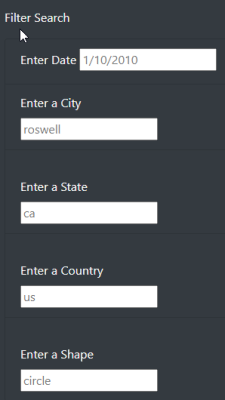

# Overview of the UFO Data Analysis

### This module,  a table was create from a JSON data array. The table we brought in using Javascript and HTML code to create an interactive, filterable web based table. This table will have the ability to filter data based on multiple criteria.

 

### Results and Explanation of the  Filtering of the UFO sightings webpage on **multiple criteria**

 

#### Using the search criteria

1.  Read the background information at the top of the page to get an idea of the project:

     

2. Look at the columns of data in the full UFO table:

     

3. Look at the possible things to filter on (each box has sample data in them to help the user fill the boxes):

     